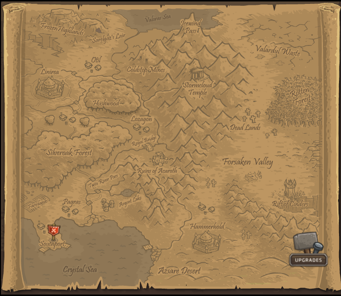
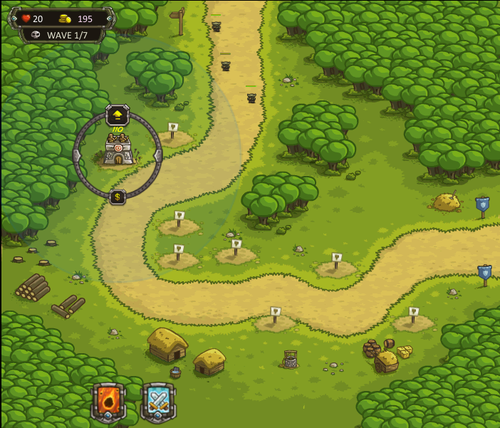
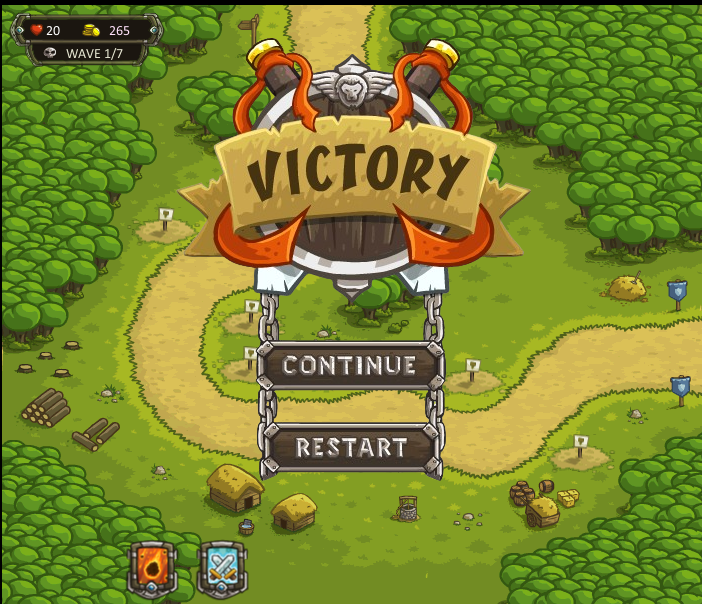

# 2026 OOPL Final Report

## 組別資訊

組別：T64

組員：

113590056 陳昱榕

113590057 李成浩

復刻遊戲：王國保衛戰

## 專案簡介

### 遊戲簡介
《王國保衛戰》遊戲背景設定在一個奇幻世界中，玩家扮演王國的最高戰術指揮官，面對由獸人、地精、亡靈等黑暗勢力組成的敵軍入侵，玩家必須沿著敵人進攻的固定路線，策略性地配置不同功能的防禦塔與主動法術，在有限的王國生命值歸零前，徹底阻擋敵人的攻勢，保衛王國的和平。
### 組別分工
* **113590056 陳昱榕**
  * **防禦塔實作**：設計防禦塔基底類別，並衍生實作「箭塔」、「兵營」、「魔法塔」與「砲塔」四座建築之升級介面、攻擊邏輯、動畫等等
  * **法術實做**：開發火球法術與召喚援軍
  * **小兵攔截邏輯**：努力完善小兵攔截邏輯

* **113590057 李城浩**
  * **敵人系統**：實作多波次敵人生成機制、多種敵人血量、傷害、技能、動畫等等
  * **UI使用者介面與控制**：開發遊戲主選單、王國生命值與金幣動態更新。
  * **音樂與素材收集**：負責遊戲素材收集，以及背景音樂添加管理。
  * **小兵攔截邏輯**：努力完善小兵攔截邏輯
## 遊戲介紹

### 遊戲規則

利用以下四座塔+兩法術去阻擋敵人進入你的領地，如果有怪物到達你的領地，你將會失去生命值，生命值失去到0，關卡過關失敗、1~9血-1星、10~17血-2星、18~20-3星

箭塔：射速極快，專門用來清理低血量的大群輕型敵人，或擊落空中單位。後續可升級為森林火槍手或弩兵堡壘。

兵營：兵營不會直接射擊，而是會召喚3名士兵在道路上攔截敵人，搭配其他防禦塔的集火輸出。

魔法塔：攻擊速度慢但傷害高，是應對重裝獸人或大型巨怪的必備利器。

砲塔：造成範圍傷害，雖然射速慢，但面對鋪天蓋地的雜魚小兵時效率極高。

火球：從天空中召喚隕石砸向指定區域，造成極高的範圍傷害。

召喚援軍：在任意位置憑空召喚2名農夫，民兵存在時間有限，會主動攔截並攻擊路過的敵人。

如果覺得太難了，可以使用 [空白鍵]跳關、[R]+100金幣

### 遊戲畫面

## 程式設計

### 程式架構
將不同的遊戲物件分權給專職的 Manager控管，並由 App 控制。

`GameManager.hpp` 管控遊戲中金錢增減、波次、遊戲內生命值。

`GameData.hpp` 紀錄遊戲外升級的加成。`UpgradeMenu` 管理遊戲外升級的選單。兩者結合創造出遊戲外升級。

`Tower.hpp` 為四座塔的抽象基底類別向下衍生出四種塔，`TowerManager` 統一管理場上所有防禦塔的行為輪詢與繪製。

`Projectile.hpp`：支援三座遠程塔的通用投射物，內建直線、拋物線軌跡演算法、單體/範圍傷害判定

`SpellManager` 處理玩家的主動技能的冷卻與釋放。`Spell.hpp`則是兩個法術的抽象類別

`Unit.hpp`：作為遊戲中所有動態生物（如敵方怪物、我方兵營士兵的抽象基底類別接著由`Enemy.hpp`、`Soldier.hpp`實做敵方於我方的生物

採用了工廠模式`EnemyFactory.hpp`來統一管理怪物的生成，當遊戲進入新的一波，需要產出一隻哥布林、獸人或薩滿時，你只需要傳入怪物的種類與地圖路徑即可。

### 程式技術
Smart Pointers：如 std::shared_ptr<Enemy>、std::shared_ptr<Tower>... 當防禦塔被賣掉、投射物落地、怪物死亡時，系統會自動安全地釋放記憶體

抽象類別：如四種塔繼承字Tower.hpp，生物繼承Unit.hpp等等

純虛擬函式：例如`Tower.hpp`中有`virtual void Upgrade() = 0;`告訴下面衍生出來的四種防禦塔都必須親自實作屬於你自己的升級邏輯

### 使用到 AI/AI Agent 的部分 (沒有用到者，不需要寫這篇)
在專案初期時跟AI討論遊戲最後的樣貌與程式框架

在已定義的`Tower.hpp`與`Unit.hpp`等抽象類別下，協助快速生成四種防禦塔與多種基礎怪物初稿，再由我們進行調整

協助實作高度參數化的 Projectile.hpp。由 AI 協助編寫直線追蹤、利用三角函數模擬的拋物線軌跡，以及利用 std::atan2 計算前後幀位移向量的動態旋轉朝向角度。

防禦塔多型：協助梳理`Tower.hpp`讓四種塔能被`TowerManager`統一管理

在`Tower::FindTarget`中，協助編寫結合「走最遠」與「狀態分流」的鎖敵邏輯，讓滿等弓箭塔可以按照要求尋找攻擊的目標。

在 `IsSellClicked`、`IsUpgradeClicked` 與 `IsMouseHovering` 函式中，協助利用`glm::distance(mousePos, btnPos)`向量公式實現環形點擊判定。

跟AI討論後 定義出`Unit.hpp`以及`Enemy.hpp`，然後在讓AI依照`Enemy.hpp`去在`EnemyFactory.hpp`做出，哥布林、獸人、狼等重複性高的工作(載入攻擊圖片、走路圖片等等)
## 結語

### 問題與解決方法
| 問題 | 解決方法 |
| :--- | :--- |
| 當實作箭塔發射的弓箭或砲塔發射的砲彈時，如果只是單純更新座標，子彈在空中飛行時看起來很怪，沒有隨著弧線上升下墜的真實物理感 | 在`Projectile`類別中引入了三角函數運算，計算前後兩影格之間的動態位移向量夾角，並將該角度即時賦予 |
|怪物死掉後還沒播放完動畫而塔還在攻擊他，讓他重複判定 `hp<0`，導致怪物重複進入死亡動畫第一幀 | 血量歸零的瞬間，立刻`m_IsDead = true`，並且讓防禦塔的索敵條件加上 `!enemy->IsDead()`，讓防去打其他活著的怪物。
|在實做擁有技能的薩滿怪物時，發現只要有薩滿的出現遊戲會閃退，經過排查後發現是跟技能圖片路徑錯誤有關|更改圖片路徑|
|||

### 自評

| 項次 | 項目                   | 完成 |
|------|------------------------|-------|
| 1    | 這是範例 |  V  |
| 2    | 完成專案權限改為 public |  V  |
| 3    | 具有 debug mode 的功能  |  V  |
| 4    | 解決專案上所有 Memory Leak 的問題  |  V  |
| 5    | 報告中沒有任何錯字，以及沒有任何一項遺漏  |  V  |
| 6    | 報告至少保持基本的美感，人類可讀  |  V  |

### 心得
這次的復刻專案讓我深刻體會到，理論與實際開發之間的巨大差異，當初直覺認為2D塔防遊戲應該相對簡單，但真正動手實作才發現處處是挑戰，從最一開始的專案規劃，究竟要先建構大體系的主世界地圖，還是先做出第一關的局內畫面？
在開發中，每當要加入一個新機制或是功能，往往意味著需要新增大量的類別與設定檔，這時我才意識到，寫程式不只是為了解決當下的需求，還要考慮到遊戲至後期，當物件、功能與關卡大量膨脹時，架構能不能撐得住
### 貢獻比例
